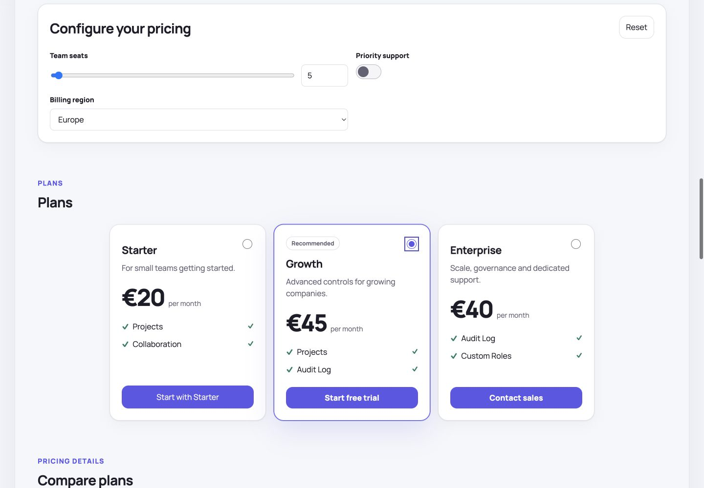
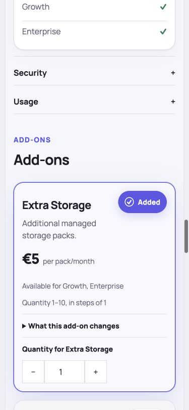
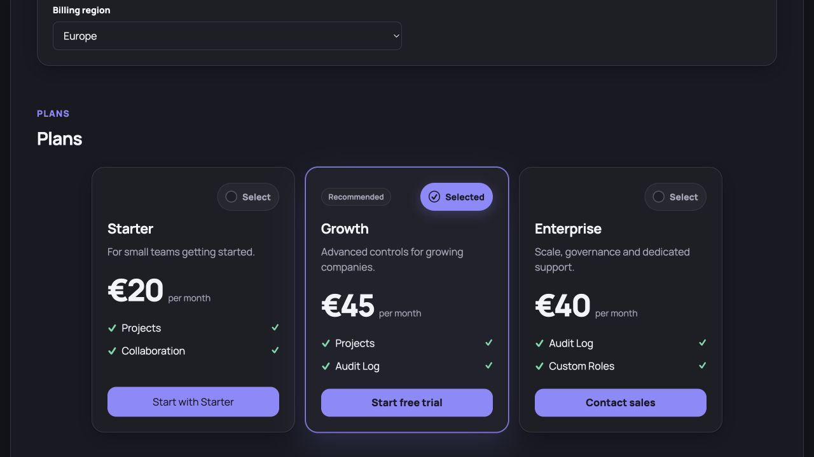

# Pricing Renderer

[](https://github.com/javiercavlop/pricing-renderer/actions/workflows/ci.yml)
[](https://github.com/javiercavlop/pricing-renderer/actions/workflows/release.yml)
[](https://www.npmjs.com/package/pricing-renderer)
[](./LICENSE)
[](./docs/pricing2yaml-compatibility.md)

Turn a Pricing2Yaml document into an elegant, responsive, interactive pricing
experience. Use the complete light-DOM Web Component, its React 18/19 adapter,
or the DOM-free TypeScript core to build a product-specific UI.



The library is distributed as the public
[`pricing-renderer`](https://www.npmjs.com/package/pricing-renderer) package.
Source, issues, release notes, and immutable version tags remain public in
[`javiercavlop/pricing-renderer`](https://github.com/javiercavlop/pricing-renderer).

## Why it exists

- Complete Pricing2Yaml 3.1 normalization and best-effort compatibility for
  other 3.x revisions.
- Reactive formulas parsed into a restricted AST—never `eval` or `Function`.
- Variables, billing periods, plan comparison, partial totals, quote prices,
  compatible add-ons, dependency/exclusion confirmation, and constrained
  quantities.
- Commercial and catalog modes with container-responsive layouts from 320 px.
- Accessible semantic HTML, keyboard flows, dark mode, forced colors, RTL, zoom,
  and reduced motion.
- CSS variables and stable `data-pr-part` hooks that let the renderer belong to
  the host product.
- Extensible syntax adapters, locale registry, allow-listed expression
  functions, and preserved custom data.
- SSR-safe imports and a client-island React/Next integration.

## Review the live example

Node.js 22+ and pnpm are required for local development:

```bash
git clone https://github.com/javiercavlop/pricing-renderer.git
cd pricing-renderer
corepack enable
pnpm install
pnpm demo
```

The showcase uses the real built package. Change seats, boolean/select
variables, billing, plans, add-ons, quantities, language, theme, and rendering
mode while watching resolved state and events.

Additional runnable integrations:

```bash
pnpm demo:react
pnpm demo:next
```

The Next example keeps the page server-rendered and isolates only the interactive
renderer behind a client boundary.



See the full [demo validation guide](./docs/demo.md).

## Installation and package location

Install the latest stable release from npm:

```bash
npm install pricing-renderer
# or
pnpm add pricing-renderer
# or
yarn add pricing-renderer
```

Pin the initial release when an exact, reproducible version is required:

```bash
npm install pricing-renderer@0.1.0
```

Release locations:

- npm package and provenance:
  [`pricing-renderer`](https://www.npmjs.com/package/pricing-renderer)
- `0.1.0` release notes and source tag:
  [`v0.1.0`](https://github.com/javiercavlop/pricing-renderer/releases/tag/v0.1.0)
- all GitHub releases:
  [`javiercavlop/pricing-renderer/releases`](https://github.com/javiercavlop/pricing-renderer/releases)

Every published GitHub Release triggers the npm CD workflow. Stable releases
publish under the `latest` dist-tag and GitHub prereleases under `next`; a tag,
version, documentation, test, accessibility, visual, or package-validation
failure stops before `npm publish`.

Confirm the installed registry version with:

```bash
npm view pricing-renderer version
```

See the [release guide](./docs/releasing.md) for provenance, validation, and
Trusted Publishing details.

## Package entry points

| Import                        | Purpose                                                         |
| ----------------------------- | --------------------------------------------------------------- |
| `pricing-renderer`            | Types, normalization, resolution, expressions, i18n, view-model |
| `pricing-renderer/yaml`       | YAML parsing and bounded remote loading                         |
| `pricing-renderer/element`    | Web Component class without global registration                 |
| `pricing-renderer/define`     | Register `<pricing-renderer>`                                   |
| `pricing-renderer/react`      | Typed React 18/19 adapter                                       |
| `pricing-renderer/base.css`   | Required structural and accessibility styles                    |
| `pricing-renderer/theme.css`  | Default professional visual tokens                              |
| `pricing-renderer/styles.css` | Base and theme combined                                         |

## Web Component

Initialize project-wide defaults before creating renderer instances:

```ts
import { configurePricingRenderer } from 'pricing-renderer';

configurePricingRenderer({
  locale: 'en-US',
  pricingPath: '/pricing',
  selectionEnabled: true,
  ctaEnabled: true,
  variablesEnabled: true,
  presentation: {
    planInheritance: 'auto',
  },
});
```

Every option is optional. The deterministic built-in defaults are English
(`en-US`), `/pricing`, selectable plans/add-ons, visible CTAs, and editable
variables. `pricingPath` is the canonical host-application route; the library
exposes it but does not mutate or install routes in the host router. An
individual element or React instance can override any value. With
`variablesEnabled: false`, formulas use the iPricing variable defaults.

Import registration and styles once:

```ts
import 'pricing-renderer/define';
import 'pricing-renderer/styles.css';
```

Render a public remote source:

```html
<pricing-renderer
  src="https://cdn.example.com/pricing.yml"
  locale="en-US"
  pricing-path="/pricing"
  mode="commercial"
  theme="auto"
></pricing-renderer>
```

`locale` and `pricingPath` are initial host configuration. Set them globally,
when the renderer is created, or through the equivalent properties/React props.
The library does not inject a language picker into production UI. The showcase
picker only demonstrates that locale configuration can be changed reactively.

Or assign a YAML string or iPricing-compatible object as a JavaScript property:

```ts
const renderer = document.querySelector('pricing-renderer');
renderer.yaml = pricingYaml;
// renderer.pricing = iPricing;
```

Exactly one of `pricing`, `yaml`, or `src` is accepted. Conflicts produce a
structured diagnostic instead of implicit precedence.

## React and Next

```tsx
'use client';

import { PricingRenderer } from 'pricing-renderer/react';
import 'pricing-renderer/styles.css';

export function PricingPage({ pricing }: { pricing: Record<string, unknown> }) {
  return (
    <PricingRenderer
      pricing={pricing}
      locale="en-US"
      pricingPath="/pricing"
      theme="auto"
      onSelectionChange={(event) => {
        console.info(event.detail.selection, event.detail.resolved);
      }}
      onAction={(event) => {
        event.preventDefault();
        openCheckout(event.detail);
      }}
    />
  );
}
```

The React entry is safe to import during SSR and is marked as a client
component. Full pricing content appears after hydration; deep light-DOM SSR is
not a v1 contract.

## Plan highlights, inheritance, and badges

Card highlights can reference both features and usage limits without ambiguity.
The hybrid mode renders configured items first and fills remaining slots from
the plan data:

```ts
configurePricingRenderer({
  presentation: {
    planInheritance: 'auto',
    planBadges: {
      growth: [
        {
          id: 'most-popular',
          label: 'Most popular',
          tone: 'accent',
          emphasize: true,
        },
      ],
    },
    planHighlights: {
      growth: {
        mode: 'hybrid',
        maxItems: 5,
        items: [
          { id: 'auditLog', kind: 'feature' },
          { id: 'storage', kind: 'usage-limit' },
        ],
      },
    },
  },
});
```

The same `PricingPresentation` object can be supplied per component or under
`custom.pricingRenderer` in YAML. Instance props win over project defaults,
which win over YAML-owned presentation values.

`planInheritance: "auto"` checks the complete feature/limit set against the
previous visible plan. “Everything in …, plus” only appears when the current
plan is demonstrably at least as capable; otherwise the claim is omitted.
Per-plan `inheritsFrom` can select a specific base plan or disable inheritance.
Badges are optional, support `accent`, `success`, `warning`, and `neutral`
tones, and only emphasize a card when `emphasize: true`.

## Variables and multicontractable add-ons

Primitive variables referenced by formulas become controls automatically.
Presentation metadata can upgrade them to sliders or selects:

```yaml
custom:
  pricingRenderer:
    planBadges:
      growth:
        - id: most-popular
          label: Most popular
          tone: accent
          emphasize: true
    variableControls:
      - path: seats
        type: slider
        label: Team seats
        min: 1
        max: 250
        step: 1
      - path: region
        type: select
        label: Billing region
        options:
          - value: eu
            label: Europe
          - value: us
            label: United States
```

Add-ons with `subscriptionConstraints` receive a quantity stepper that respects
`minQuantity`, `maxQuantity`, and `quantityStep`. Dependency and exclusion
changes are listed in an accessible confirmation dialog before mutation.
Usage-limit values expressed as `.inf` render as the localized **Unlimited**
label.

## CTAs and host-owned checkout

```ts
renderer.presentation = {
  ctas: [
    {
      id: 'start-growth',
      planId: 'growth',
      label: 'Start free trial',
      href: '/checkout/growth',
      metadata: { source: 'pricing-page' },
    },
  ],
};

renderer.addEventListener('pricing-action', (event) => {
  event.preventDefault();
  openCheckout(event.detail);
});
```

The cancelable event includes the selected plan, billing period, variables,
add-ons, resolved prices, subtotal, quote state, and metadata. Checkout,
authentication, and contracting remain host responsibilities.

Public events:

- `pricing-ready`
- `pricing-selection-change`
- `pricing-action`
- `pricing-diagnostic`

## Private remote sources

Secrets are property-only and never reflected into markup:

```ts
renderer.src = 'https://api.example.com/private/pricing.yml';
renderer.request = {
  credentials: 'include',
  headers: async () => ({
    Authorization: `Bearer ${await refreshAccessToken()}`,
  }),
  timeoutMs: 15_000,
  maxBytes: 2 * 1024 * 1024,
};
```

Use `loadPricing` for OAuth exchanges, signed URLs, proxies, or SDK clients. The
built-in loader permits HTTP/HTTPS `GET` only, defaults to
`credentials: "omit"`, honors cancellation, and never fetches during SSR.

## Theming

```css
pricing-renderer {
  --pr-color-accent: #0057ff;
  --pr-radius-lg: 0.75rem;
  --pr-shell-padding: clamp(1rem, 3vw, 2.5rem);
}

pricing-renderer [data-pr-part='plan-card'] {
  font-family: var(--brand-font);
}
```

Import `styles.css` for the full theme or only `base.css` and supply your own.
CSS variables and `data-pr-part` values are stable; internal `pr-*` classes are
not. Read the [theming guide](./docs/theming.md) before applying broad host
resets to light-DOM content.



## Headless and extension APIs

```ts
import {
  createPricingViewModel,
  normalizePricing,
  registerMessageCatalog,
  resolvePricing,
} from 'pricing-renderer';
import { loadPricingFromUrl, parsePricingYaml } from 'pricing-renderer/yaml';
```

Extend future/vendor syntax with `PricingSyntaxAdapter`, translations with
`registerMessageCatalog`, and domain calculations through explicitly
allow-listed expression functions. See [Extending](./docs/extending.md).

## Documentation

- [Architecture](./docs/architecture.md)
- [API reference](./docs/api-reference.md)
- [Project and instance configuration](./docs/configuration.md)
- [Demo and release acceptance](./docs/demo.md)
- [Release and npm publication](./docs/releasing.md)
- [Extending the library](./docs/extending.md)
- [Theming](./docs/theming.md)
- [Internationalization](./docs/i18n.md)
- [Pricing2Yaml compatibility](./docs/pricing2yaml-compatibility.md)
- [Contributing](./CONTRIBUTING.md)
- [Security policy](./SECURITY.md)
- [Changelog](./CHANGELOG.md)

## Quality gates

```bash
pnpm lint
pnpm format:check
pnpm typecheck
pnpm test
pnpm build
pnpm test:browser
pnpm package:check
```

Browser coverage includes Chromium, Firefox, WebKit, Axe, keyboard paths, and
visual breakpoints. Releases use Changesets, SemVer, npm provenance, and MIT.

## Security

Pricing text is escaped, links use safe schemes, and expressions cannot reach
globals or prototypes. `private` only controls presentation—remove confidential
data before delivering YAML to a browser. Report vulnerabilities through the
process in [SECURITY.md](./SECURITY.md).
