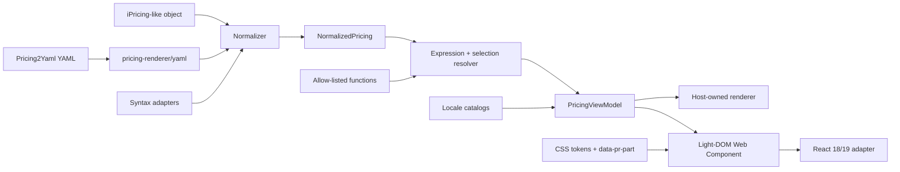

# Architecture

`pricing-renderer` separates pricing semantics from presentation so consumers can
use the complete UI or compose their own. The package is ESM-only and each public
entry point has a deliberately narrow dependency surface.

## Layer boundaries

| Layer        | Public entry point         | Responsibility                                           | Must not depend on    |
| ------------ | -------------------------- | -------------------------------------------------------- | --------------------- |
| Core         | `pricing-renderer`         | Normalize, resolve, internationalize, create view-models | DOM, Lit, React, YAML |
| YAML         | `pricing-renderer/yaml`    | Strict YAML parsing and bounded remote loading           | UI frameworks         |
| Element      | `pricing-renderer/element` | Custom Element class without global registration         | React                 |
| Registration | `pricing-renderer/define`  | Idempotent `<pricing-renderer>` registration             | Application state     |
| React        | `pricing-renderer/react`   | Typed React properties and event mapping                 | Checkout or routing   |
| Styles       | CSS subpaths               | Structural base and optional visual theme                | Global resets         |

The core initialization configuration defaults to `locale: "en-US"` and
`pricingPath: "/pricing"`. The path is routing metadata for the integrating
application; the library never mutates a router or assumes a framework.
Per-instance values override project defaults, which is preferable for
request-specific SSR configuration.

The normalized model is owned by this package. Pricing4TS-compatible objects are
accepted structurally, but Pricing4TS types are not exposed in the public
contract. Unknown `custom` data and the original input remain available through
`NormalizedPricing.custom` and `NormalizedPricing.raw`.

## Data pipeline

1. Exactly one source is accepted: `pricing`, `yaml`, or `src`.
2. YAML parsing rejects duplicate keys and non-map roots, limits aliases, and
   emits structured diagnostics.
3. Optional syntax adapters convert a known future or vendor syntax into a
   Pricing2Yaml 3.x-compatible object.
4. Normalization preserves formulas as `PriceSource` values and validates the
   supported version.
5. A selection is merged with YAML defaults without losing meaningful `0` or
   `false` values.
6. Expressions are parsed into a restricted AST. Variables resolve first,
   followed by billing multiplier and add-on quantity.
7. The view-model filters visibility, merges presentation configuration, builds
   variable controls, and creates comparison groups.
8. The host renderer or the supplied Web Component consumes the same view-model.

Diagnostics are values, not thrown authoring errors. A blocking diagnostic makes
`PricingResult.ok` false; warnings remain attached to a usable value.

## State model

The element supports controlled and uncontrolled state:

- `selection` is controlled. The host must write the next selection after
  receiving `pricing-selection-change`.
- `defaultSelection` seeds internal state once.
- With neither property, defaults come from the normalized pricing.
- Changing `pricing`, `yaml`, `src`, request options, loader, or normalization
  options reloads the source and cancels obsolete requests.

The renderer retains the last valid numeric result when an interactive
expression temporarily fails. The invalid control receives an accessible error
instead of collapsing the whole pricing page.

## Responsive rendering

The element observes its own container, not the viewport. `layout="auto"` moves
between the compact and table presentations from the element width. The
comparison data is represented once per active layout; there is no viewport-wide
carousel and the document itself is never expected to scroll horizontally.

The Web Component renders into light DOM. This allows typography and design
tokens to participate in the host theme, but it also means broad host selectors
can affect descendants. The supported styling contract is documented in
[Theming](./theming.md).

## SSR model

All entry points are safe to import in an SSR build. The React adapter is marked
`"use client"` and the full pricing UI is a client island. The library does not
fetch remote sources on the server. Deep SSR/hydration of light DOM is not a v1
contract; hosts should reserve space or provide a stable skeleton.

## Security boundaries

- Expressions never use `eval`, `Function`, global lookup, constructors,
  prototypes, assignment, or arbitrary calls.
- Extension functions are explicit, local allow-list entries.
- YAML uses the core schema with custom tags disabled.
- The built-in loader accepts only HTTP/HTTPS `GET`, defaults to anonymous
  credentials, and enforces timeout and size limits.
- Secrets are JavaScript-only properties and are never reflected into HTML.
- YAML strings are rendered as text. Arbitrary HTML is not accepted.
- `private` is a visual filter, not an authorization boundary.

## Adding a feature

Prefer the lowest layer that owns the behavior:

- Pricing semantics, version support, calculations, or view-model fields: core.
- Source parsing or transport: YAML.
- Interaction and semantic markup: element.
- React-specific typing: React adapter.
- Visual changes: CSS tokens first, then a documented `data-pr-part`.

Every new public capability needs types, unit tests, documentation, a Changeset,
and browser coverage when it changes rendered behavior.
